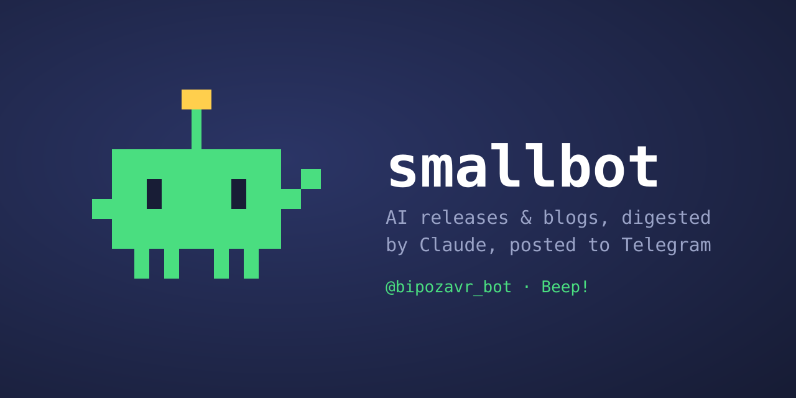

A Cloudflare Worker that watches AI release feeds and blogs, digests them with
Claude, and posts to Telegram channels as **@bipozavr_bot**. Beep!

## The channels

| Channel | What lands there |
| --- | --- |
| [@claudecode_changelog](https://t.me/claudecode_changelog) | Claude Code releases: what actually matters and whether it's worth updating |
| [@codex_changelog](https://t.me/codex_changelog) | OpenAI Codex CLI releases |
| [@model_drops](https://t.me/model_drops) | New models in the Anthropic API + OpenAI model announcements, with press-release digests |
| [@anthropic_blogs](https://t.me/anthropic_blogs) | Everything Anthropic writes: claude.com/blog, news, engineering |
| [@openai_blogs](https://t.me/openai_blogs) | The full OpenAI blog |

## How it works

Cron tick every 15 minutes. Per source: fetch → diff against a KV cursor or
seen-set → LLM digest → post. KV is written only after a successful Telegram
post, so any failure just retries on the next tick; sources are isolated, one
failing doesn't block the rest.

Some choices worth stealing:

- **No RSS? Scrape the index.** claude.com and anthropic.com publish no feeds;
  the server-rendered index pages of `/blog`, `/news`, and `/engineering` are
  both the trigger and the article source.
- **Trust dist-tags, not changelogs.** A changelog entry isn't a release; npm's
  `latest` for `@anthropic-ai/claude-code` / `@openai/codex` gates what gets
  posted. GitHub Releases are read via the atom feed — the anonymous REST
  quota is permanently exhausted on Cloudflare's shared egress IPs.
- **LLM-assigned importance tiers.** Blog posts are never dropped, only tuned:
  major (new models, consumer product launches, potential breaking news) gets
  pinned, minor (case studies, B2B, policy) arrives without a notification.
- **No hardcoded model ids.** The digesting model is resolved daily from
  `/v1/models` (freshest non-dated alias), with a known-good fallback pinned
  automatically if a new model breaks the call surface.

## Run your own

Needs Node 22+ (wrangler's requirement).

1. Create a bot via @BotFather and your channels; make the bot a channel admin
   (post + edit messages — the latter is what allows pinning in channels).
2. `npx wrangler kv namespace create RELEASES`, put the namespace id and your
   channel usernames into `wrangler.jsonc`.
3. Set the secrets:

   ```sh
   npx wrangler secret put TELEGRAM_BOT_TOKEN
   npx wrangler secret put ANTHROPIC_API_KEY
   npx wrangler secret put TRIGGER_SECRET   # long random string; guards the manual POST /run trigger
   ```

4. `npx wrangler deploy`. On first run the changelog sources post their newest
   release; the model and blog watches seed their history silently and start
   posting from the next fresh item.

Development: `npm test`, `npm run dev` (dry-run by default — copy
`.dev.vars.example` to `.dev.vars` and fill it in). Test fixtures are verbatim
fragments of the public upstream sources they parse (the Claude Code
CHANGELOG.md, a GitHub Releases atom feed, the OpenAI news RSS). CLAUDE.md
holds the full operational notes — written for Claude Code, useful for humans
too.
